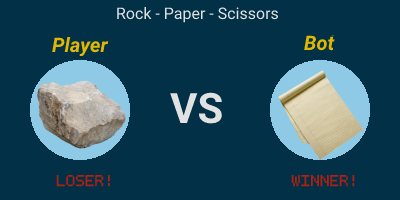

# DiscordOnTheGo
This project is a [Discord](https://discord.com/) chat bot that I wrote in order to learn Golang. Discord is a VoIP, instant messaging, and digital distribution platform targeted primarily towards gamers. My project uses the Discord API in order to run an interactive chat bot with users on a Discord server.

In terms of file structure, the backbone of the project is located in main.go and messages/messages.go. The most interesting code of this project so far would be the image generation for Rock Paper Scissors (See [Interesting Features](#interesting-features)). Images of the server in action can be seen in [Screenshots](#screenshots).

*Note: This project is still under developement*

---
## User Commands
- ```!ttt``` - Plays a game of TicTacToe against another player
- ```!RPS``` - Playes a game of Rock Paper Scissors against the discord bot
- ```!apod``` - Retrieves and displays NASA's Astronomy Picture of the Day and description

## Interesting Features

### Rock Paper Scissors
The [games/RPS/draw module](games/RPS/draw/draw.go) is one of the more interesting modules of this project. Whenever a user plays a game of Rock Paper Scissors against the bot an image is generated representing the outcome of the game.



This image is generated using the Go image/draw package which defines only one operation: drawing a source image onto a destination image, through an optional mask image (see: [image/draw](https://go.dev/blog/image-draw)).

The image background is generated automatically upon server start up or whenever a user sends a command to change one of the background colours. The rest of the image is drawn based off the RPS game status such as what the user played, what the bot played, and who the winner is.

The following commands are used to change colours (Note 0 0 0 denote RGB integer values 0-255)

- ```!rps set-circle 0 0 0``` - Sets the background circle colours
- ```!rps set-bg 0 0 0``` - Sets the main background color
- ```!rps set-default``` - Resets all colours to default settings

Here is an example of the colours after a user induced change:


---
# Screenshots

## Server Side Terminal Logging


## Astronomy Picture of the Day


## TicTacToe


## Rock Paper Scissors


